# RangeSet

半開区間の集合を**重複を許さず**管理するデータ構造。`MyMultiSet` の亜種。

## ライセンス (license)
Copyright (c) 2024 NokonoKotlin Released under the MIT license(https://opensource.org/licenses/mit-license.php)

## NokonoKotlin のお気持ち
- ライブラリに組み込むのは自由だけど、自分のライブラリと称するのはやめてほしいよ。あとちゃんと著作権表示してね。

## 簡単な説明

それぞれの区間を Splay Tree のノードと対応させ、SplayTree の Node には区間 $[L,R)$ を表すメンバ $L,R$ を持たせる。

区間を以下の制約を満たす様に管理する。

1. $R$ の順序でソートされている。
2. 隣接する区間 $[a,b) , [b,c)$ があるなら、マージして $[a,c)$ とする。

## 使い方
区間の座標の型を `T`、区間を管理するオプションとして `bool` 型 `strong_debug` をテンプレートパラメータにとる。

### 基本機能
- #### `insert(lef,rig)`
    - 区間 `[lef,rig)` を格納する。
    - 以下のオプションがある。
        - `strong_debug` が `true` なら、`[lef,rig)` が既存の区間と重複部分を持っている場合にエラーになる。
        - `strong_debug` が `false` なら、`[lef,rig)` が既存の区間と重複部分を持っている場合、それらがカバーする領域を結合して $1$ つの区間とする。
- #### `erase(lef,rig)`
    - 格納されている区間に対して、`lef,rig)` と重複する部分を全て削除する。
    - `insert` の処理で重複をマージしていた場合でも構わず一度に削除する。
- #### `cover_length(lef,rig)` 
    - 格納されている区間と、`[lef,rig)` の重複部分のサイズを求める。
    - ただし区間 $[l,r)$ のサイズを $r-l$ と定義する。
- #### `get(i)` 
    - 昇順で `i` 番目の区間を表す `SplayNode` のコピーを返す。`MyMultiSet` 同様に、隣接ノードのポインタを封印している。
- #### `Delete(i)` 
    - 昇順で `i` 番目の区間を削除する。
- #### `GetRange(l,r)` 
    - 昇順で `l` 番目以上 `r` 番目未満のノードをカバーする部分木の根のコピーを返す。`MyMultiSet` 同様に、隣接ノードのポインタを封印している。
    - `cover_length` と**混同しないように注意**。
- #### `upper_bound(k)` 
    - `R` が `k` 以下の区間の個数を返す
- #### `lower_bound(k)`
    - `R` が `k` 未満の区間の個数を返す
- #### `find_included(k)` 
    - 座標 `k` をカバーする区間が、昇順で何番目のものかを 0-index で返す。
    - 存在しなければ `-1` を返す。
- #### `find_cross(lef,rig)`
    - 格納されている区間のうち、`[lef,rig)` と重複部分をもつ区間が、昇順で何番目のものかを 0-index で返す。
    - 複数存在する場合は**いずれか $1$ つ** を返す。
    - 存在しなければ `-1` を返す。

## RangeSet の中身
### 課題

$N$ 個の区間 $[L_1,R_1) , [L_2,R_2) , \dots , [L_N,R_N) $ と、$M$ 個の区間 $[S_1,T_1) , [S_2,T_2) , \dots , [S_M,T_M)$ がある。

$[L_1,R_1) , [L_2,R_2) , \dots , [L_N,R_N)$ が成す数直線上の領域と $[S_1,T_1) , [S_2,T_2) , \dots , [S_M,T_M)$ が成す数直線上の領域の共通部分の長さを答えよ。

#### 制約

- $1\leq N,M \leq 2\times10^5$
- $ -10^9 \leq L_i < R_i \leq 10^9 $
- $ -10^9 \leq S_i < T_i \leq 10^9 $

### 区間を平衡二分木に乗せる

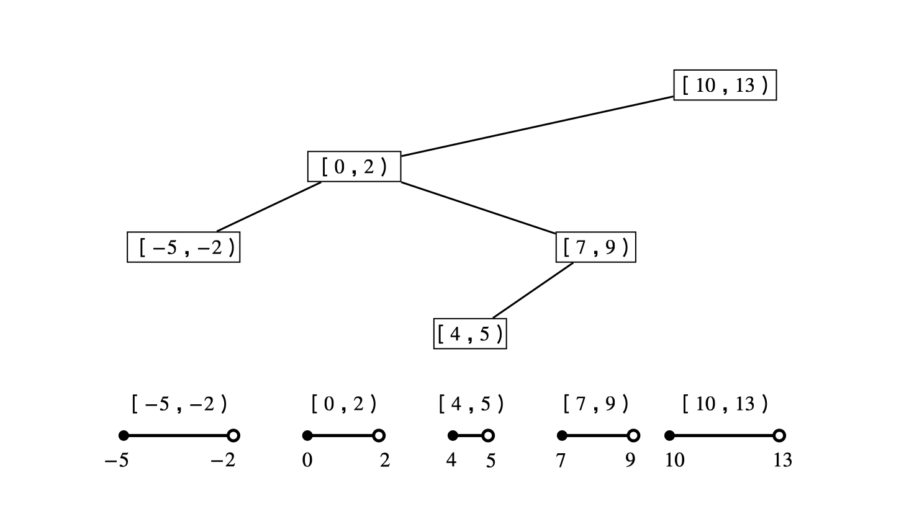 

以下の要件を満たすように、平衡二分木のノードに区間 $[L,R)$ を表すメンバ $L,R$ を持たせます。
1. $R$ の順序でソートされている。
2. 部分木のノードの $R-L$ の総和を集約として持つ。
3. 全ての区間は互いに重複せず、挿入で重複部分ができたらそれらをマージする。
4. 隣接する区間 $[a,b) , [b,c)$ があるなら、マージして $[a,c)$ とする。

#### 1. $R$ でソートされている。
$x$ をカバーするノード (区間) にアクセスすることを考えます。$R$ が $x$ より大きいもので、最も $R$ が小さいノード ( 区間 $P$ とする ) を見ることで、$x$ 付近の区間にアクセスできます。

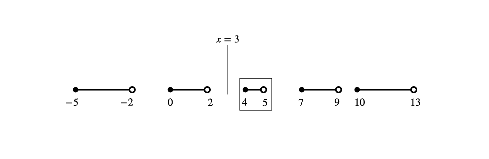 

このとき、区間 $P$ に $x$ が含まれなければ、$x$ をカバーする区間はない。逆に、$x$ が含まれていれば $P$ が答えです。

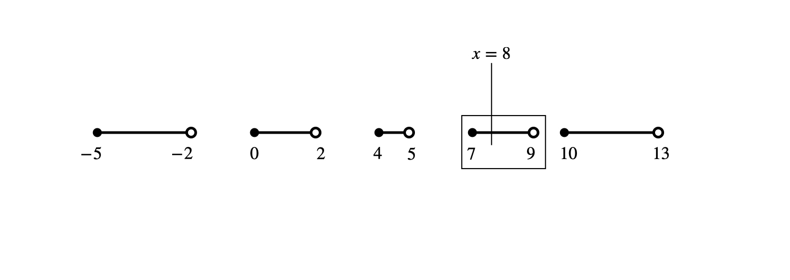 

#### 2. 部分木のノードの $R-L$ の総和を集約として持つ。

$R-L$ と言うのは、区間 $[L,R)$ の長さです。これを集約しておくことで、以下のクエリに応えることができます。
- 管理している区間で、区間 $[a,b)$ と重複する部分の長さを答えよ。

<b>$a,b$ がどちらも同じ区間に含まれる場合は $b-a$ が答えです。</b>よって、そうでない場合を考えます。

まず、区間 $[a,b)$ に完全に覆われている部分は、$R-L$ の集約を計算します。

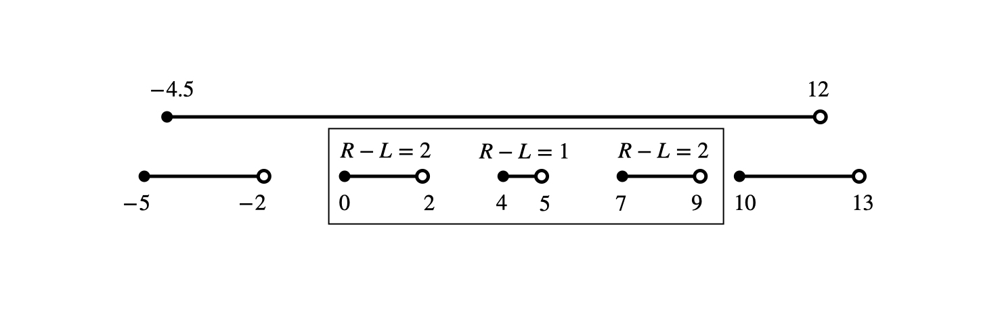 

$a$ を含む区間と $[a,b)$ の重複部分の長さと $b$ を含む区間と $[a,b)$ の重複部分の長さを足し合わせることで答えがわかります。

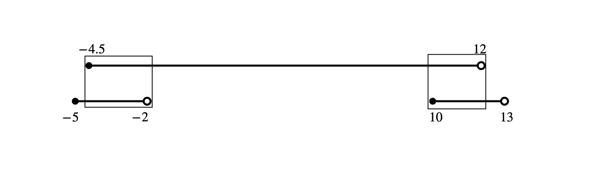 

#### 3. 全ての区間は互いに重複しない。& 4. 隣接する区間はマージする。

これらの処理は、区間を追加する操作の時に行うことにします。以下は区間 $[3,7)$ を新たに追加する様子です。

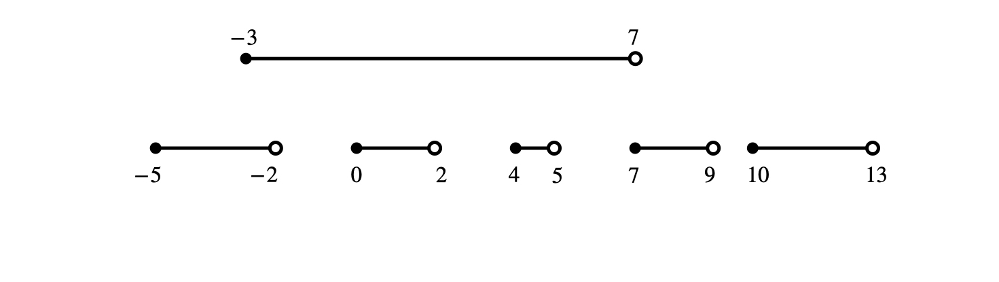 

まず、追加したい区間に完全にカバーされる区間は平衡二分木から削除します。

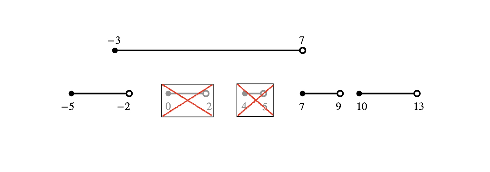 

それ以外の部分 (両端) で重なる部分が存在すれば、マージして一つの区間として挿入します。この時、両端と隣接する区間もマージしておきます (要件 4)。

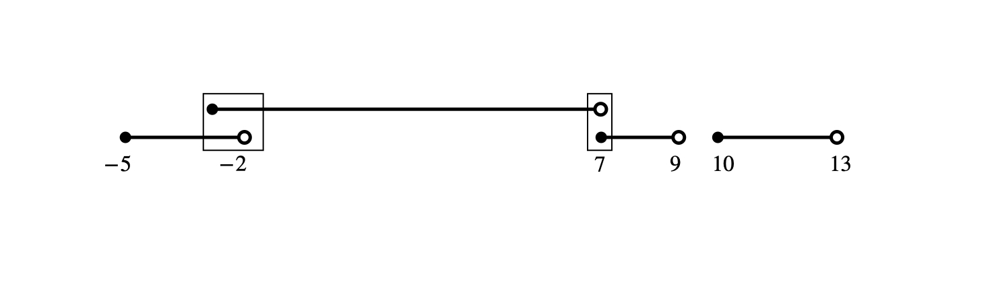 

結果、重複部分を一つの区間にまとめて以下のようになります。

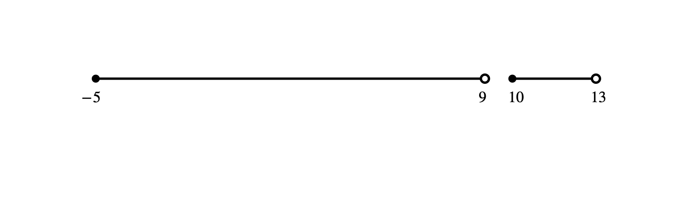 

重複区間を $1$ つにまとめるのは非直観的だと思うなら、重複部分をもつ区間の追加を禁止するように assert しましょう。実際のところ、どう処理するべきかは状況によります。

#### 区間の削除

管理している区間から、$[a,b)$ と重なる部分だけを削除します。

この時、追加操作の時に重複していた部分も削除されることに注意してください。

##### 区間 $[-4,-1)$ を削除
削除する部分が、既存の区間に含まれている場合、その部分を削除して既存の区間を $2$ 分割します。

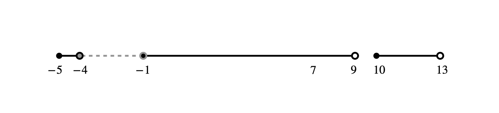 

##### 区間 $[6,10)$ を削除
この場合も同様です。

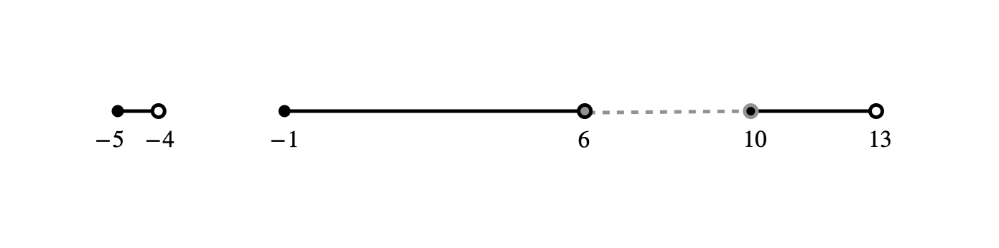 

##### 区間 $[-4,11)$ を削除
削除したい区間が既存の区間に完全に含まれない場合、まず、削除したい区間に完全にカバーされている既存の区間を全て削除します。

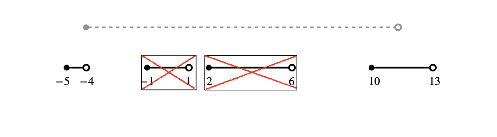 

その後、一部だけ重複している部分を縮小します。

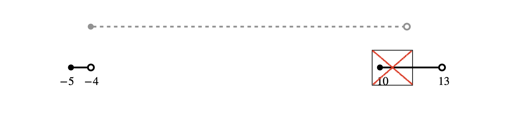 

#### 計算量について
ある区間に注目すると、その区間は追加と削除が高々 $1$ 度まで行われます。また、区間のマージや縮小の対象になる回数の総和はクエリの回数で抑えることができるので、クエリ全体を通して計算量は準線形時間です。
